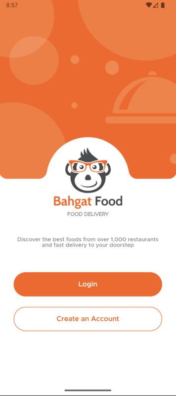

# BahgatResturant

Food delivery app for Android devices Built using [JetpackCompose](https://developer.android.com/jetpack/compose) UI toolkit.

### JetpackCompose: 

Jetpack Compose is Android’s modern toolkit for building native UI. It simplifies and accelerates UI development on Android. Quickly bring your app to life with less code, powerful tools, and intuitive Kotlin APIs.

# Screenshots: 
PageView  |  Welcome  | Signup |
:-------: | :-------: | :-----: 
  |  | 

Login | OTP
:----:|:---: 
 |  
___

Home 1 | Home 2
:----: | :---: 
 |  

   Menu   |   Offers  | Profile | More  |
:-------: | :-------: | :-----: | :-----: 
  |  |   | 

Original design by: [Akila Weerakoon](https://www.behance.net/gallery/108639283/Meal-Monkey-Food-delivery-iOS-mobile-application)
